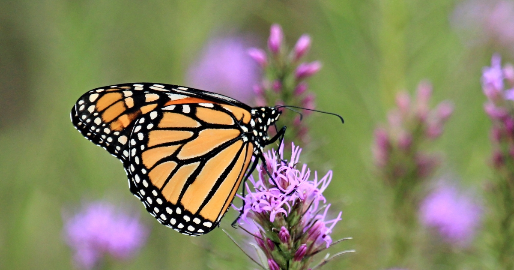
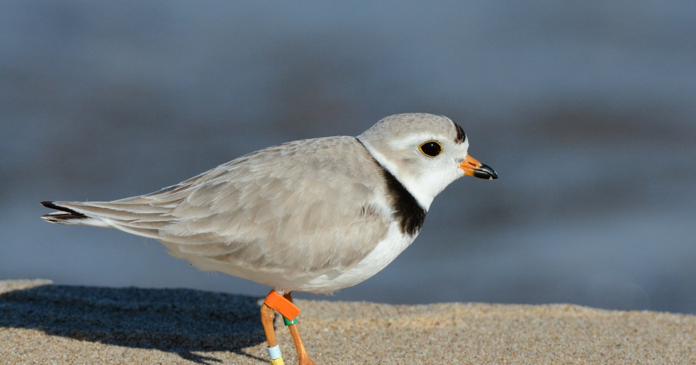

# 🦋 Westport River Watershed Species Cards

A custom **HTML/CSS environmental communication component** developed for the Westport River Watershed Dashboard.

## Project Overview

This repository contains interactive species-information cards created as an embedded web component for the larger **Westport River Watershed Dashboard**.

The cards were designed to present biodiversity and conservation information in a compact, visual format that could be embedded directly into the dashboard experience.

The project combines **environmental science communication, web development, and visual design** to make species and conservation information easier for public audiences to explore and understand.

---

## Featured Species

The species cards include:

- Monarch Butterfly
- Piping Plover
- Roseate Tern

Each card incorporates visual assets and species imagery to support accessible environmental storytelling.

---

## Tools & Skills

**HTML • CSS • Web Design • Environmental Science Communication • Visual Communication • Biodiversity Education**

- **HTML** — structured the species-card content and layout.
- **CSS** — controlled visual styling, spacing, typography, and presentation.
- **Environmental science communication** — translated species and conservation information into concise public-facing content.
- **Visual design** — combined photographs, vector graphics, and interface design to create an engaging educational component.

---

## Project Files

- [`index.html`](index.html) — main HTML structure for the species cards
- [`style.css`](style.css) — visual styling and layout
- [`Monarch_USFWS.jpg`](Monarch_USFWS.jpg) — Monarch image asset
- [`Piping_Plover_USFWS.jpg`](Piping_Plover_USFWS.jpg) — Piping Plover image asset
- [`Roseate Tern_USFWS.jpg`](Roseate%20Tern_USFWS.jpg) — Roseate Tern image asset
- [`monarch_vector2.png`](monarch_vector2.png) — Monarch vector graphic
- [`Piping_Plover_Vector.png`](Piping_Plover_Vector.png) — Piping Plover vector graphic
- [`roseate_tern_vector.png`](roseate_tern_vector.png) — Roseate Tern vector graphic

---

## Visual Assets

### Monarch Butterfly

<p align="center">
  
</p>

---

### Piping Plover

<p align="center">
  
</p>

---

### Roseate Tern

<p align="center">
  
</p>

---

## Role Within the Westport River Watershed Dashboard

The species cards serve as the **Species Spotlight** component of the larger **Westport River Watershed Dashboard**.

Designed as compact information cards, the component highlights three locally relevant species — **Monarch Butterfly, Piping Plover, and Roseate Tern** — and provides users with accessible species and conservation information directly within the dashboard experience.

The Species Spotlight is part of a broader environmental communication project exploring:

- Biodiversity
- Water quality
- Land use
- Climate resilience
- Watershed health
- Human impacts

By embedding custom **HTML and CSS** within the dashboard, the Species Spotlight extends the GIS-based application beyond maps and data visualizations to include visually engaging, public-facing environmental education.

This component demonstrates how **web development, visual design, and science communication** can be integrated into an interactive environmental GIS project.

---

## Design Approach

The species cards were developed to be:

- Visually engaging
- Compact enough for dashboard embedding
- Easy to scan
- Suitable for public-facing environmental education
- Consistent with the broader visual design of the watershed dashboard

Custom HTML and CSS allowed the cards to be styled beyond the default interface options available within the larger GIS dashboard environment.

---

## Future Development

Potential future improvements could include:

- Additional local and protected species
- Responsive mobile styling
- Interactive hover or expandable content
- Direct links to conservation resources
- Improved accessibility and screen-reader support
- Dynamic species information loaded from structured environmental data

---

## Image Credits

Species photographs included in this repository are identified as **USFWS image assets** in the project filenames.

Vector graphics were created or prepared for use within the species-card interface.

---

## Author

**Alyssa Pacheco**

Environmental Scientist | Coastal & Marine Science | GIS & Environmental Data Analysis
```
